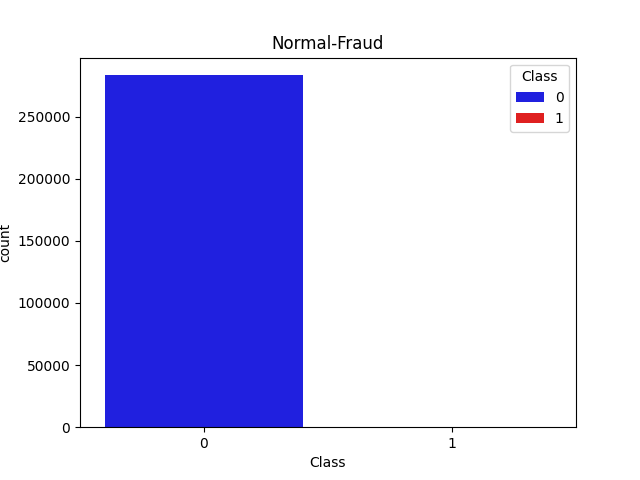
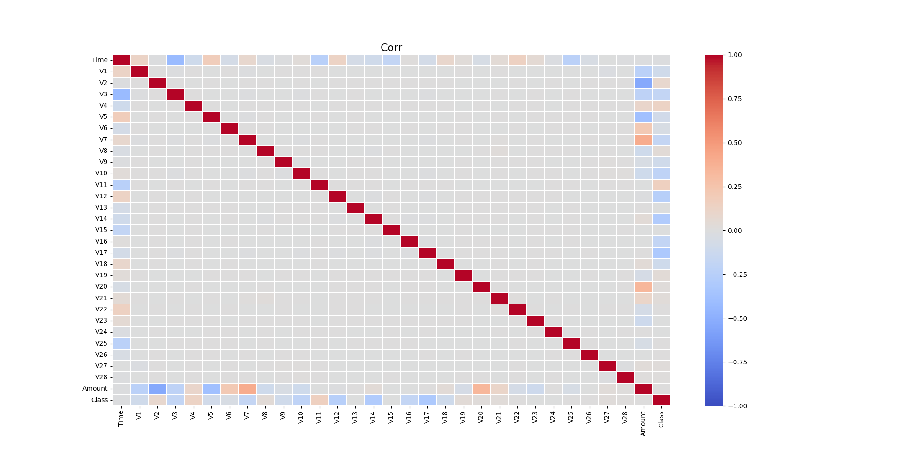
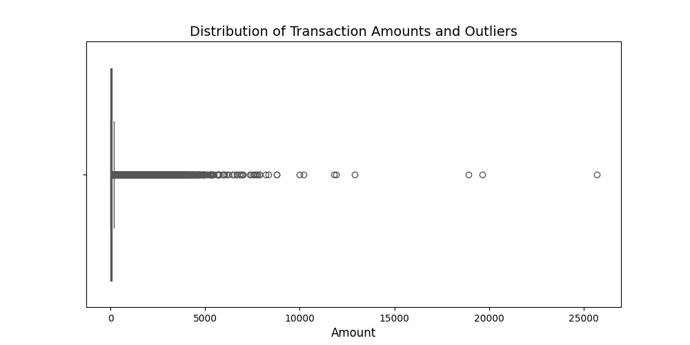
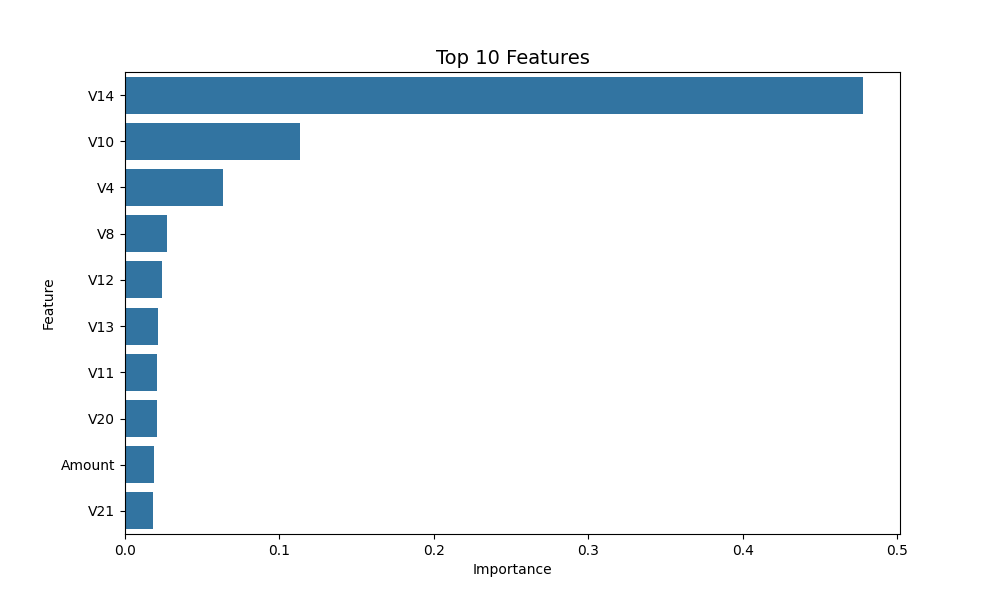

# credit_card_fraud_detection
Kredi kartı sahtekarlığı tespiti için makine öğrenmesi projesi.

# Kredi Kartı Sahtekarlığı Tespiti (Credit Card Fraud Detection)

Bu proje, makine öğrenmesi algoritmaları kullanarak kredi kartı işlemlerindeki sahtekarlık durumlarını tespit etmeyi amaçlamaktadır. 
**[Kaggle: Credit Card Fraud Detection Dataset](https://www.kaggle.com/datasets/mlg-ulb/creditcardfraud/data)**

## Veri Seti Hakkında

Projede kullanılan veri seti, Avrupa'daki kart sahipleri tarafından yapılan kredi kartı işlemlerini içermektedir. Veri setiyle ilgili temel özellikler şunlardır:

* **Aşırı Dengesiz Yapı:** Veri setinde yasal işlemlerin sayısı, sahte işlemlerin sayısından çok daha fazladır. Sahtekarlık vakaları tüm verinin çok küçük bir yüzdesini oluşturur.
* **PCA Dönüşümü:** Müşteri gizliliğini korumak amacıyla veri setindeki özelliklerin büyük bir kısmı (V1'den V28'e kadar olan sütunlar) PCA ile dönüştürülmüştür. 
* **Orijinal Değişkenler:** Sadece `Time` ve `Amount` değişkenleri orijinal haliyle bırakılmıştır. Aşırı değerler içerdiği için `Amount` değişkeni modellemeye girmeden önce `RobustScaler` ile ölçeklendirilmiştir.

## Kullanılan Algoritmalar

Verideki aşırı sınıf dengesizliğiyle başa çıkmak ve en doğru tahminleri yapabilmek için aşağıdaki makine öğrenmesi algoritmaları kullanılmıştır:

* **Logistic Regression**
* **Random Forest Classifier**
* **XGBoost**

Modeller **Accuracy** yerine sınıf dengesizliğine daha uygun olan **Precision**, **Recall** ve **F1-Score** metrikleriyle değerlendirilmiş ve XGBoost modeli üzerinde `RandomizedSearchCV` kullanılarak hiperparametre optimizasyonu yapılmıştır.

## Proje Görselleri

### 1. Veri Seti Dengesi

### 2. Özellikler Arası İlişki

### 3. Aykırı Değer (Outlier) Analizi
Veri setindeki uç değerlerin tespiti ve RobustScaler kullanımı öncesi analiz:

### 4. Modelin Karar Mekanizması
Eğitilen modelin en çok dikkat ettiği özellikler:

